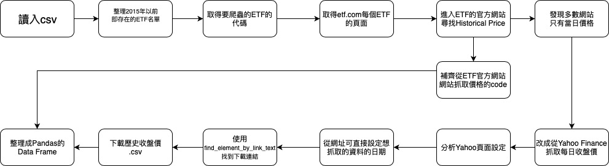

# ETF - History Data of the Price Information
利用爬蟲方法整理2015-12-31前已存在的 ETF 集合中，找尋2015-12-31至2019-03-21之每一檔 ETF 的每日收盤價之Dataframe

## Package
- os: 處理文件與目錄
- pandas: 讀取csv檔與資料處理，並製作Dataframe
- selenium: 爬蟲套件
- datetime: 日期格式化
- time: 時間延遲（讀取網頁時強制等待）

## Flowchart

## 5種當別人使用你的程式最有可能會遇到的錯誤情況
- ETF home page 通常只有單日的每日收盤價，而且在haomepage提供歷史資料的公司不多。因此先在yahoo finance找全部的歷史收盤價，再從有歷史資料的官網爬取歷史收盤價，取代yahoo finance的資料
- yahoo finance的 start date, end date是以秒為單位，因此每日的間隔為86400，若要在yahoo finance存取特定日期的時間格式，可以以此方法計算，或先在yahoo finance網站搜尋特定日期，將其時間格式抓下來
- yahoo finance從csv檔讀取資料沒問題，若直接從網頁爬取資料，會有幾欄描述發dividend之狀況，所以直接抓取csv file比較單純
- 下載csv檔需要sleep強制停止3-5 second，否則可能會前一個網站來不及下載結束，造成檔案沒被下載
- file可能在子資料夾內，因此以os module呼叫file時記得先join

